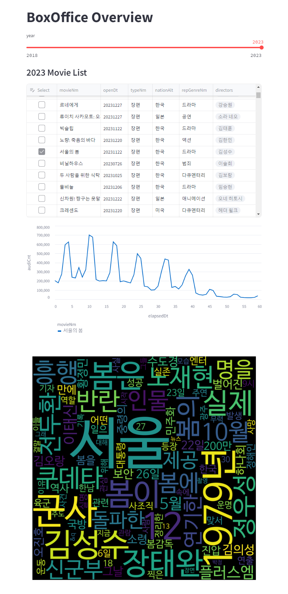

data_analysis
=============
각종 데이터 분석(전처리, 시각화) 기록입니다.

# Movie (진행중; 60%)
## description
- kobis, naver api를 사용하여 영화 관련 데이터 수집
- streamlit을 사용하여 시각화 대시보드 구성
## to-do list
- 영화 필터링, 영화 관련 텍스트 필터링 (ex. 형태소 분석, 불용어 제거)
- 다양한 시각화 방법 추가 (ex. 두 개 이상의 영화를 비교)
- DB에서 데이터 관리

# User Behavior (보류; 5%)
## description
- kaggle e-commerce 데이터 활용
- EDA, AARRR 분석, 가설 검증 
- 구매 예측 모델 생성
## to-do list
- 아자아자!

# Process Mining (보류; 5%)
## descrition
- kaggle process 데이터 활용
- pm4py를 사용하여 프로세스마이닝 분석 모듈 생성
## to-do list
- 화이팅!
